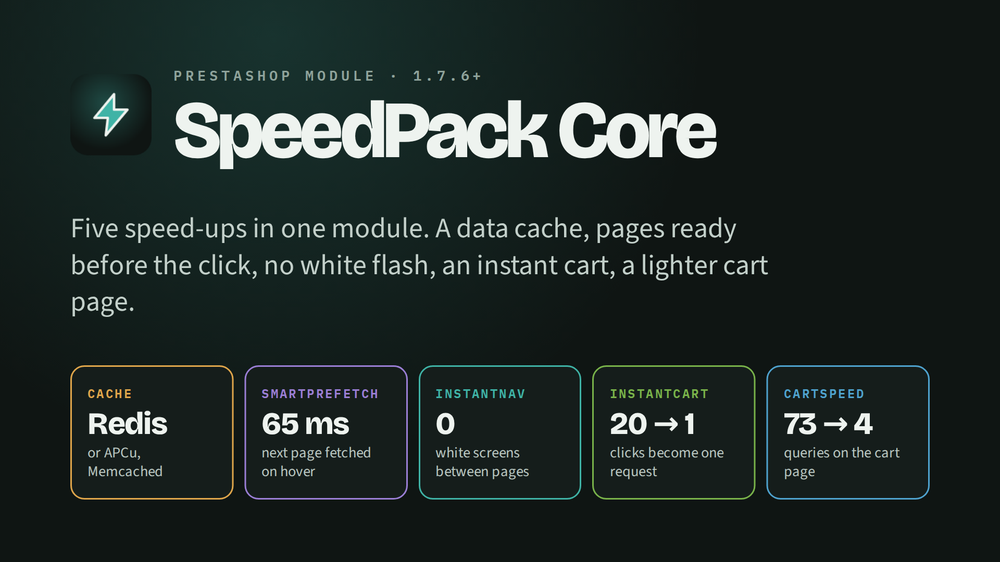
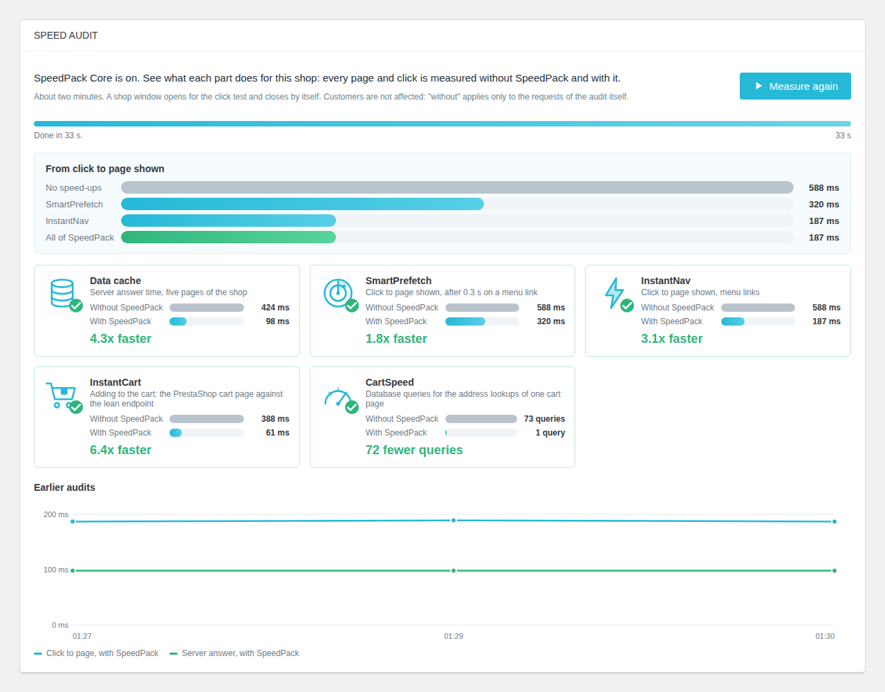
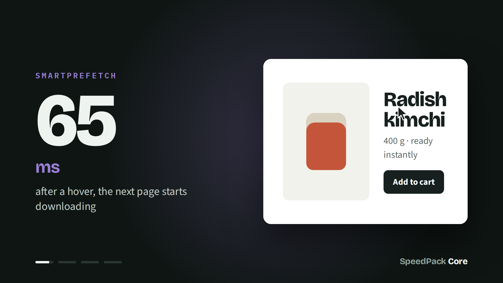
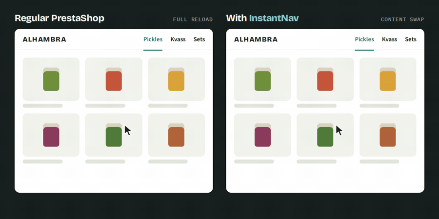
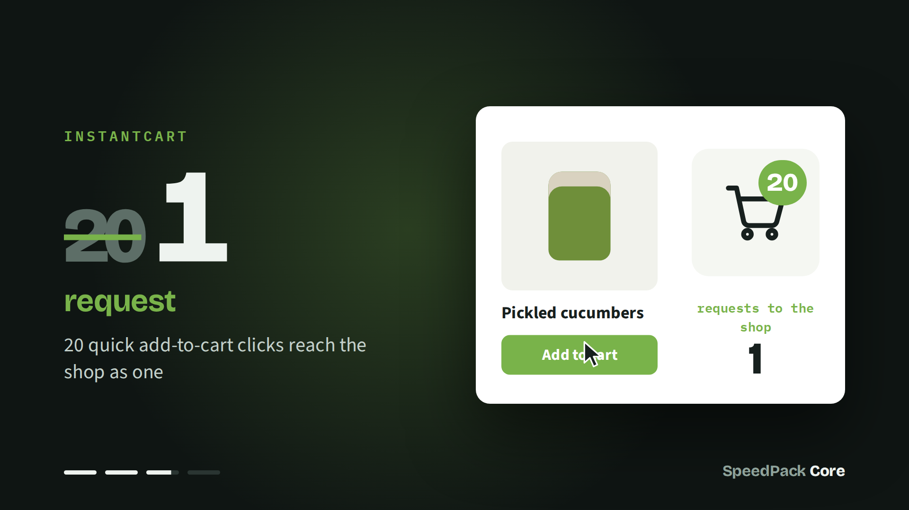
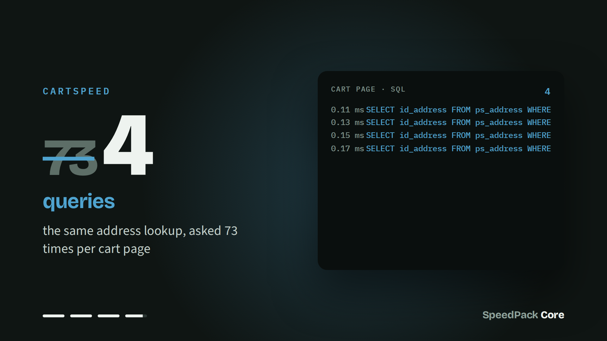
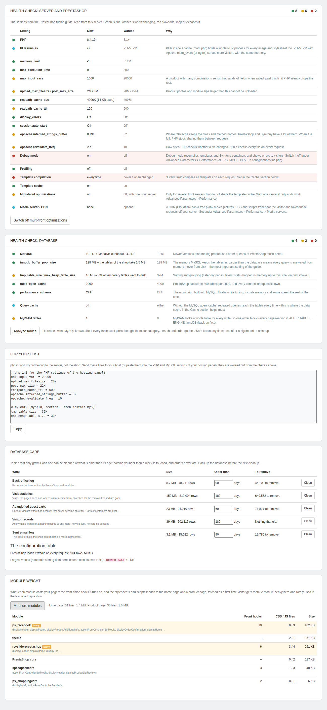
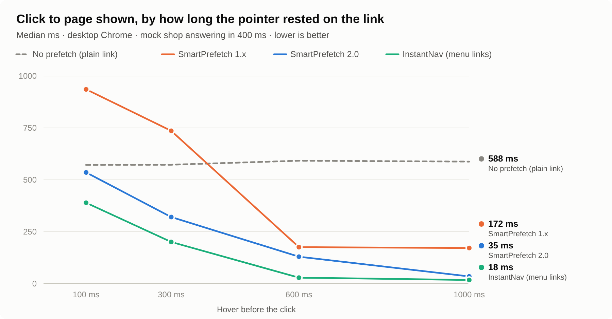

  

  
  
  
  
  

# SpeedPack Core

**Make your PrestaShop shop feel instant.** Database results come from memory, the next page loads before the click, menu clicks swap the content without a reload, the cart reacts at once and the cart page runs 95% fewer repeated queries. Five speed-ups, one module, each with its own switch.

<a href="media/speedpack.mp4">▶ Watch in full quality (mp4, 13 s)</a>

| Part | What it removes | The number |
|---|---|---|
| **Cache** | Waiting for the database | Query results kept in **Redis, APCu or Memcached** |
| **SmartPrefetch** | Waiting for the next page | Starts downloading **65 ms** after a hover; on a longer hover Chrome builds the whole page |
| **InstantNav** | The white flash between pages | **0** white screens; the header never reloads |
| **InstantCart** | Waiting after "Add to cart" and +/− | **20 clicks → 1 request** (4.75 s → 1.73 s on a slow server) |
| **CartSpeed** | Repeated queries on the cart page | **73 → 4** address lookups per cart page |
| **Health check** | Slow settings nobody looked at | PrestaShop's own tuning guide, **checked on your server**, plus database care |

InstantCart and CartSpeed figures were measured on the Alhambra shop. SmartPrefetch and InstantNav figures are the modules' default settings. The built-in **speed audit** measures all five on your own shop. Full numbers in [Benchmarks](#benchmarks).

## Why merchants use it

- **Shoppers browse further** when every page answers at once: no white flash between pages, no waiting after "Add to cart".
- **Less work for your server:** database results come from memory, quick cart clicks are merged into one request, and the cart page skips dozens of identical queries.
- **Install and go:** sensible defaults, one settings page, a separate switch for each part, no theme files to edit.
- **See the difference on your own shop:** the speed audit measures every part with SpeedPack and without it, in about a minute.
- **Safe by design:** a cache is switched on only after it passes a live test, pages that change something (cart, checkout, account, log out) are never fetched ahead, and any error falls back to the normal page load.

## What shoppers notice

- Pages open the moment they click: the next page is already downloaded while the pointer rests on the link.
- The header, menu and cart stay in place between pages, with no white flash.
- "Add to cart", removing a line and changing a quantity all respond instantly, even on a slow phone connection.

## Features

### Speed audit · *new in 1.2*

The audit screen, here run against the module's test shop.

- One button on the settings page, offered right after install: **each part measured without SpeedPack and with it**, on your shop and your server, in about a minute
- **Data cache:** server answer time of five of your pages (home, two busiest categories, two best sellers)
- **SmartPrefetch and InstantNav:** a shop window opens and clicks through your menu, timing click to page shown with no speed-ups, with each part and with everything
- **InstantCart:** adding to the cart through PrestaShop's cart page against the lean endpoint
- **CartSpeed:** database queries for the address lookups of a cart page
- Animated results with before/after bars, and a chart of earlier audits to see the effect of later changes
- Customers are not affected: "without" is a signed cookie, valid 15 minutes, that only the audit's own requests carry

### Cache – database results from memory · *new in 1.1*

- Data cache in **Redis**, **APCu** or **Memcached**, whichever your server has
- Switched on only after a live test: connect, password, database, write and read. A wrong host or password is refused and the shop stays as it was
- If the cache server goes down later, the shop keeps working without it, slower but never an error page
- Every Redis key carries a prefix of its own, so **Empty the cache** never touches another site on the same server
- **OPcache panel:** hit rate, memory and files, with plain advice on what to ask your host for
- **PrestaShop speed settings** in one place: template compiling, template cache, combined CSS and JavaScript, browser caching
- **Warm-up:** after emptying, the module visits the home page, every category and the best-selling products, so no customer gets the slow first load

### SmartPrefetch – the next page before the click

- Starts downloading a page 65 ms after the pointer rests on its link, or a finger touches it
- **New in 1.2:** in Chrome and Edge it uses the browser's own Speculation Rules: the page is prefetched on hover and, when the pointer stays 250 ms, built in full in the background (prerender), so the click shows it at once. At most 4 prerenders per visit, never on touch
- Other browsers keep the service-worker cache (60 s, separate for signed-in and signed-out shoppers); a click arriving while a fetch is still running now waits for it instead of downloading the page twice
- At most 12 fetches per page, and up to 3 main-menu or slider links warmed up on the first page of a visit; links InstantNav swaps in are left to InstantNav
- Never fetches cart, checkout, account or log-out pages, or links that add, delete or carry a token
- Stands down when the visitor has Data Saver on or a 2G connection

### InstantNav – menu clicks without a reload

- Swaps only the page content for the links you choose (default: the main menu, desktop and mobile)
- The header, menu and cart never reload, so there is no white flash
- A loading outline in your theme's own colours, shown only if a page takes longer than 140 ms
- Transitions: none, fade, fade and rise, fade and settle; uses the View Transitions API where the browser has it, and respects "reduced motion"
- Back and forward buttons, page title, focus and scroll all work; scripts in the new content run as usual

### InstantCart – the cart without waiting

- The cart count goes up the moment the shopper clicks; a lean endpoint saves the product in the background
- Quick clicks are merged: 20 clicks reach the shop as 1 request
- "Add to cart" buttons on category lists, search results and the home page, for products that need no choice
- Instant removal on the cart page, with Undo
- **Instant quantity change on the cart page** · *new in 1.1*: +, − and a typed number change the line at once; the shop hears the final quantity once, and refusals (stock, minimum) come back with the shop's own message
- Anything uncertain, such as a required customisation, falls back to PrestaShop's own add to cart, so nothing gets lost

### CartSpeed – a lighter cart page

- PrestaShop checks "does this address exist?" for every price and tax in the cart; CartSpeed remembers the answer for the rest of the page
- 73 identical queries → 4 on one cart page (measured), with an on/off switch

### Health check – PrestaShop's tuning guide, checked on your shop · *new in 1.3*

The health check as it renders; the database-care and module-weight numbers in this picture are sample data.

PrestaShop's [optimization guide](https://devdocs.prestashop-project.org/9/scale/optimizations/) is a list of settings to look up by hand. The health check reads them from the running shop and says, in green, amber or red, what to change and why:

- **PHP:** version, PHP-FPM or mod_php, `memory_limit`, `max_input_vars`, upload sizes, `display_errors`, `session.auto_start`, and the realpath cache **with how full it actually is** (better than the guide's fixed 4096K); OPcache's interned-strings buffer (with its fill) and `revalidate_freq`, on top of the OPcache panel the Cache section already had
- **PrestaShop:** debug mode and the profiler (both common on live shops, both slow), template compilation, the template cache, multi-front optimizations (one click to switch off on a single server), media servers / CDN, the Composer autoloader
- **Database:** server version, **`innodb_buffer_pool_size` against the real size of your tables** (the guide's most important setting), temporary tables (with the share that went to disk), `table_open_cache`, `performance_schema`, the query cache, and MyISAM tables left over
- **For your host:** the `php.ini` and `my.cnf` lines for every failing check, worked out for this shop (the buffer pool sized from your database), with a Copy button – a module cannot change them, the host can
- **Analyze tables:** `ANALYZE TABLE` on every table of the shop in small batches (the guide's `mysqlcheck -a`), so MySQL picks the right indexes
- **Database care** (the guide's *Taking care of PrestaShop*): the back-office log, visit statistics, abandoned guest carts, orphaned guest records, 404 and search statistics and the e-mail log – each with its size, how much is older than its age, and a Clean button that works in batches. Nothing younger than a week is touched, **orders and customer carts never are**, and a guest is only removed when no visit, cart or account points to it and it is older than every visit kept
- **The configuration table**, which PrestaShop loads whole on every request: its size and its largest values (a module keeping data there, or left behind by one)
- **Module weight:** for each module, the front-office hooks it runs on and the CSS / JS files and bytes it adds to the home page and a product page, fetched as a first-time visitor gets them – the heavy ones flagged

Where the guide has aged it is not followed: `magic_quotes_gpc` and `opcache.fast_shutdown` no longer exist, MySQL 8 has no query cache (so the guide's "skip the data cache when MySQL is local" only holds on old servers – the Cache section now shows whether yours has one, and the speed audit measures the real gain), and PrestaShop 9 has no Smarty "caching type" any more.

## Also in the pack: AsyncCart

**Just the instant cart page, as a module of its own.** For shops that want only this part, without the rest of SpeedPack Core. **[asynccart-1.0.0.zip](dist/asynccart-1.0.0.zip)** · source in [`asynccart/`](asynccart/)

 

- **Quantity:** +, − and a typed number change the line and the header count at once; clicks within the wait (400 ms by default, 100–2000 ms) reach the shop as one request with the final quantity
- **Remove:** the line slides away at once, with **Undo** for 5 seconds, even after the shop has deleted it; typing 0 removes too
- **Totals** come back from lean endpoints and are updated in place; the page re-renders only when vouchers change or the cart empties
- **Refusals** (stock, minimum quantity) put the number back with the shop's own message
- The theme's own +/− handlers never see these clicks, so nothing runs twice
- **Stands aside** when SpeedPack Core's InstantCart already handles the cart page, so two modules never answer one click

## Benchmarks

<picture>
  <source media="(prefers-color-scheme: dark)" srcset="media/benchmark-dark.png">
  
</picture>

**How it was measured.** A mock shop whose pages answer after 400 ms (an uncached PrestaShop on an ordinary host) and a real headless Chromium. Each run rests the pointer on a menu link for a set time, clicks, and times **click → first paint of the new page** from inside the page itself, so no DevTools connection is attached (Chrome switches prerendering off whenever one is). Every click goes to an address no earlier run used, so no cache can answer for it. Medians of 6–8 clicks per cell, 2026-10-06.

#### Click to page shown, desktop (ms, lower is better)

| Hover before the click | 100 ms | 300 ms | 600 ms | 1000 ms |
|---|---:|---:|---:|---:|
| Plain link, no prefetch | 572 | 573 | 592 | 588 |
| `<link rel=prefetch>` (the common "instant page" trick) | 944 | 729 | 592 | 564 |
| Speculation Rules prefetch | 536 | 329 | 176 | 176 |
| Speculation Rules prerender | 511 | 340 | 128 | 32 |
| SmartPrefetch 1.x (service worker) | 936 | 736 | 176 | 172 |
| **SmartPrefetch 2.0** (Chrome, Edge) | **536** | **321** | **130** | **35** |
| **SmartPrefetch 2.0** (other browsers, service worker) | **533** | **337** | **173** | **184** |
| **InstantNav** (menu links) | **390** | **201** | **29** | **18** |

#### On a slow connection (150 ms round trip, 4 Mbit/s)

| Hover before the click | 100 ms | 300 ms |
|---|---:|---:|
| Plain link | 721 | 720 |
| Speculation Rules prefetch | 688 | 485 |
| Speculation Rules prerender | 772 | 460 |
| **InstantNav** | **548** | **347** |

#### What the numbers say

- **`<link rel=prefetch>` makes PrestaShop slower.** PrestaShop pages carry no cache lifetime, so the browser downloads the prefetched page again on the click, and a quick click waits for both. SmartPrefetch 2.0 no longer uses it.
- **Prefetch alone stops at ~175 ms**: the HTML is ready, but the browser still has to build the page. Only a prerender (or InstantNav's swap) gets below 50 ms.
- **Prerender needs time.** Started at the first hover, it is no better than prefetch on a quick click, and worse on a slow connection where it competes for bandwidth. SmartPrefetch 2.0 therefore prefetches at 65 ms and prerenders only once the pointer has stayed 250 ms, at most 4 pages per visit and never on touch.
- **SmartPrefetch 1.x was slower than no prefetch on quick clicks** (936 ms at 100 ms): a click arriving mid-download fetched the page a second time. 2.0 waits for the download already running instead.
- **InstantNav is the fastest on menu links** because only the content changes: no new page, no re-running the theme's scripts, the header stays. With both on, SmartPrefetch leaves menu links to InstantNav.

#### Measured on a real shop (Alhambra)

| | Without | With SpeedPack |
|---|---:|---:|
| 20 quick "+" clicks on a cart line, slow server (InstantCart) | 20 requests, 4.75 s | 1 request, 1.73 s |
| Address lookups on one cart page (CartSpeed) | 73 queries | 4 queries |

#### Measure your own shop

Shops differ: the theme, the modules and the server decide the real numbers. The **speed audit** on the settings page runs the same kind of test on your shop in about a minute: server answer time of five of your pages with and without the data cache, click to page shown through your menu with no speed-ups, SmartPrefetch, InstantNav and everything, add to cart through PrestaShop's cart page against InstantCart, and CartSpeed's query count. Results are kept, so a chart shows the effect of later changes. The audit times a quick 0.3 s hover; a longer hover is faster still in Chrome and Edge (prerender, see above), which a test window opened from the back office cannot show.

## Installation

1. Download **[speedpackcore-1.3.0.zip](dist/speedpackcore-1.3.0.zip)**.
2. In the back office, go to **Modules > Module Manager > Upload a module** and choose the zip.
3. Click **Install**. SmartPrefetch, InstantNav, InstantCart and CartSpeed are switched on with their defaults; the data cache stays off until you choose one.
4. Click **Configure**: each part has a status panel, its settings and its switch. To use Redis, enter its host and password under **Cache** and press **Save and test**.
5. Press **Measure my shop** at the top of the settings page: the speed audit shows what each part does for your shop in about a minute (allow the pop-up window it opens).
6. Open your shop and check: hover a menu link and click it (no white flash), add a product from a category page (the count goes up at once), change a quantity in the cart.

> [!NOTE]
> - If you had the separate SmartPrefetch, InstantNav, InstantCart or CartSpeed modules, uninstall them first.
> - CartSpeed overrides `Address::addressExists()`. If another module already overrides it, PrestaShop shows a conflict on install.
> - Redis needs overrides: leave "Disable all overrides" off under Advanced Parameters > Performance.
> - On a theme that is not based on Classic, set InstantNav's "Links swapped" and "Region replaced" selectors to match your theme.

## Technical details

| | |
|---|---|
| **Compatibility** | PrestaShop 1.7.6.0 to 9.x, PHP 7.1 or newer, multistore |
| **Hooks** | `actionFrontControllerSetMedia`, `displayHeader`, `displayProductListReviews` |
| **Overrides** | `Address::addressExists()`, installed and removed with the module. With Redis on, the module also writes `override/classes/cache/CacheRedis.php` |
| **Files it changes** | With a data cache on, `app/config/parameters.php` (cache entries only; the original is kept as `parameters.php.speedpackcore.bak`) |
| **Front controllers** | `add`, `remove`, `qty` (InstantCart endpoints) |
| **Database** | No new tables; its configuration values are all removed on uninstall. The health check reads `SHOW VARIABLES`, `SHOW GLOBAL STATUS` and `information_schema`; it only writes when you press Clean or Analyze |
| **Privacy** | No personal data stored by the module, and no cookies for shoppers. The speed audit sets one signed `spc_audit` cookie in the admin's own browser for the duration of the audit. In the browser: two `sessionStorage` keys and a cache of shop pages kept 60 seconds, separate for each signed-in shopper |
| **Requirements** | Chrome and Edge need nothing more. Other browsers use the service worker: HTTPS, and the `Service-Worker-Allowed` header that the module's `.htaccess` sends on Apache and LiteSpeed. The speed audit needs cURL on the server and the shop on the same address as the back office for its click test. The Redis, APCu or Memcached PHP extension for the data cache. Plain JavaScript, about 22 KB gzipped in total |

## Source

SpeedPack Core lives in [`speedpackcore/`](speedpackcore/) and AsyncCart in [`asynccart/`](asynccart/); installable zips are in [`dist/`](dist/). See the [changelog](CHANGELOG.md).

## Other languages

<b>Français</b>

**Votre boutique devient instantanée.** Les résultats de la base de données viennent de la mémoire, la page suivante se charge avant le clic, le menu change de page sans rechargement, le panier réagit tout de suite et la page panier fait 95 % de requêtes répétées en moins.

- **Cache :** Redis, APCu ou Memcached, activé seulement après un test réel (connexion, mot de passe, écriture et lecture) ; panneau OPcache, réglages de performance de PrestaShop, vidage et préchauffage du cache.
- **SmartPrefetch :** télécharge la page 65 ms après le survol du lien, et dans Chrome et Edge la construit entièrement après 250 ms (prerender) ; ne précharge jamais le panier, la commande, le compte ni la déconnexion.
- **InstantNav :** le menu remplace seulement le contenu ; l'en-tête, le menu et le panier restent en place, sans écran blanc.
- **InstantCart :** ajout, suppression et changement de quantité immédiats ; 20 clics rapides = 1 requête.
- **CartSpeed :** 73 requêtes identiques → 4 sur une page panier.
- **Audit de vitesse :** chaque partie mesurée avec et sans SpeedPack sur votre boutique, en une minute environ.
- **Contrôle de santé :** le guide d'optimisation de PrestaShop vérifié sur votre serveur (PHP, base de données, réglages), les lignes à envoyer à l'hébergeur, le nettoyage de la base et le poids de chaque module.

**Installation :** Modules > Gestionnaire de modules > Installer un module, choisissez `speedpackcore-1.3.0.zip`, puis Configurer.

<b>Polski</b>

**Sklep działa od ręki.** Wyniki z bazy danych przychodzą z pamięci, następna strona ładuje się przed kliknięciem, menu przełącza strony bez przeładowania, koszyk reaguje natychmiast, a strona koszyka wysyła o 95% mniej powtarzanych zapytań.

- **Cache:** Redis, APCu lub Memcached, włączany dopiero po prawdziwym teście (połączenie, hasło, zapis i odczyt); panel OPcache, ustawienia szybkości PrestaShop, czyszczenie i rozgrzewanie cache.
- **SmartPrefetch:** pobiera stronę 65 ms po najechaniu na link, a w Chrome i Edge po 250 ms buduje ją w całości (prerender); nigdy nie pobiera koszyka, zamówienia, konta ani wylogowania.
- **InstantNav:** menu podmienia tylko treść; nagłówek, menu i koszyk zostają na miejscu, bez białego ekranu.
- **InstantCart:** dodawanie, usuwanie i zmiana ilości od razu; 20 szybkich kliknięć = 1 zapytanie.
- **CartSpeed:** 73 identyczne zapytania → 4 na stronie koszyka.
- **Audyt szybkości:** każda część zmierzona ze SpeedPack i bez niego w Twoim sklepie, w około minutę.
- **Kontrola:** poradnik optymalizacji PrestaShop sprawdzony na Twoim serwerze (PHP, baza danych, ustawienia), gotowe linie dla hostingu, porządki w bazie i waga każdego modułu.

**Instalacja:** Moduły > Menedżer modułów > Załaduj moduł, wybierz `speedpackcore-1.3.0.zip`, potem Konfiguruj.

---

Made by **Alhambra** for our own PrestaShop store · MIT License · See also [Prestashop-InstantNav](https://github.com/mateusz-stelmasiak/Prestashop-InstantNav) and [Prestashop-SmartPrefetch](https://github.com/mateusz-stelmasiak/Prestashop-SmartPrefetch)
