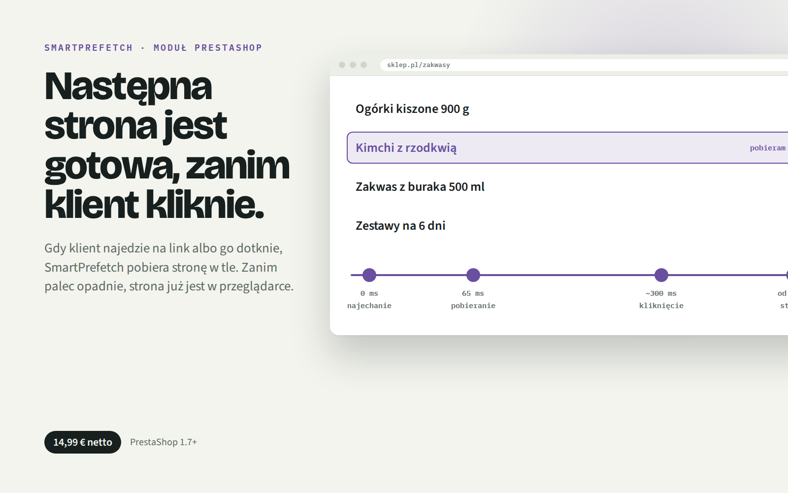
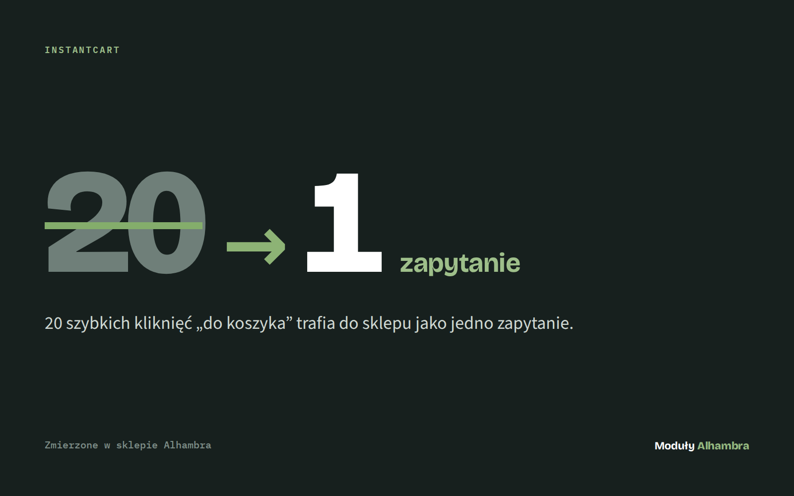
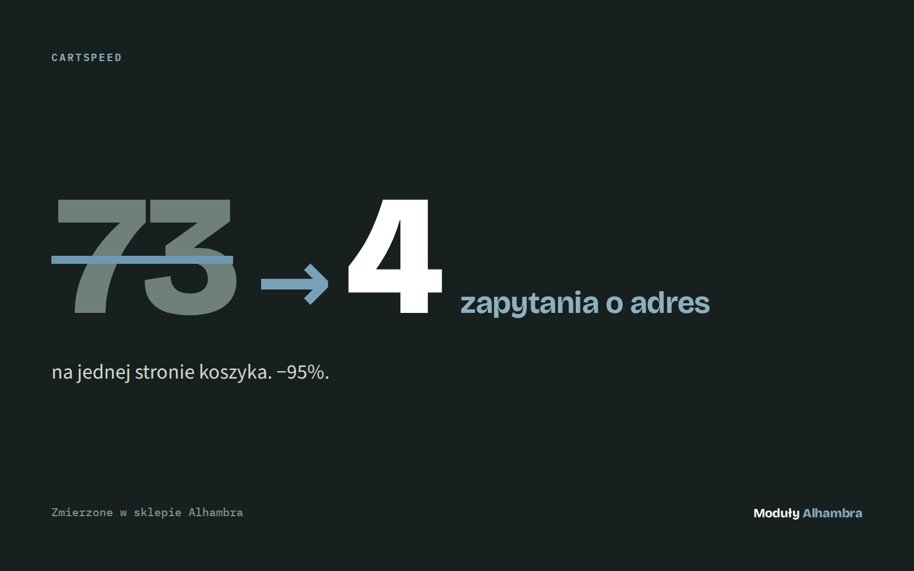

  
  
  
  

<a href="media/speedpack.mp4">▶ Watch in full quality (mp4, 13 s)</a>

# Prestashop SpeedPack Core

**Core pack of modules to speed up your shop.** Four small PrestaShop modules, each removing one kind of waiting: before the click, between pages, at the add-to-cart button, and inside the cart. Built for our own store, [Alhambra](https://github.com/mateusz-stelmasiak), and measured there.

| Module | What it removes | The number |
|---|---|---|
| **SmartPrefetch** | Waiting for the next page | Starts downloading **65 ms** after a hover |
| **InstantNav** | The white flash between pages | **0** white screens; the header never reloads |
| **InstantCart** | Waiting after "Add to cart" | **20 clicks → 1 request**; 4,75 s → 1,73 s on a slow server |
| **CartSpeed** | Repeated database queries in the cart | **73 → 4** address lookups per cart page |

InstantCart and CartSpeed figures were measured on the Alhambra shop. SmartPrefetch and InstantNav figures are what the modules do by design (their default settings).

## SmartPrefetch

**The next page is ready before the click.** Hover or touch a link and the page starts downloading in the background. By the time the click lands, it's already there.

- Starts 65 ms after the hover; at most 12 fetches per page, so no wasted data
- Never fetches links that change something: add to cart, remove, log out, anything with a token
- Stands down when the visitor has data saver on or a 2G connection

## InstantNav

**Menu clicks without a page reload.** Only the content swaps; the header, menu and cart stay where they are.

- Fetches the page on hover, keeps it for 60 seconds
- A loading outline in your theme's own colours, shown only if a page takes longer than 140 ms
- Back and forward buttons, page title and focus all work; any error falls back to a normal page load

## InstantCart

**The cart reacts before the server does.** The shopper sees the product in the cart the moment they click. The server saves it in the background, and quick clicks merge into one request.

- Add-to-cart buttons on category lists
- Instant removal from the cart, with Undo
- 20 quick clicks reach the shop as 1 request

## CartSpeed

**Your cart stops asking the database the same question.** PrestaShop checks "does this address exist?" for every price and tax in the cart. CartSpeed remembers the answer for the rest of the page view.

- 73 identical queries → 4 on one cart page
- Zero settings: install and done
- One small override of `Address::addressExists()`, removed again on uninstall

## Works together

Each module works on its own. Together they cover a whole visit: SmartPrefetch fetches the page while the mouse moves, InstantNav swaps it in without a flash, InstantCart makes adding to the cart instant, and CartSpeed makes the cart page itself lighter. When SmartPrefetch is installed, InstantNav takes pages straight from its cache.

## Requirements

PrestaShop 1.7.6 or newer, PHP 7.1+. No other modules or libraries needed.

---

Made by **Alhambra**. See also [Prestashop-InstantNav](https://github.com/mateusz-stelmasiak/Prestashop-InstantNav) and [Prestashop-SmartPrefetch](https://github.com/mateusz-stelmasiak/Prestashop-SmartPrefetch).
